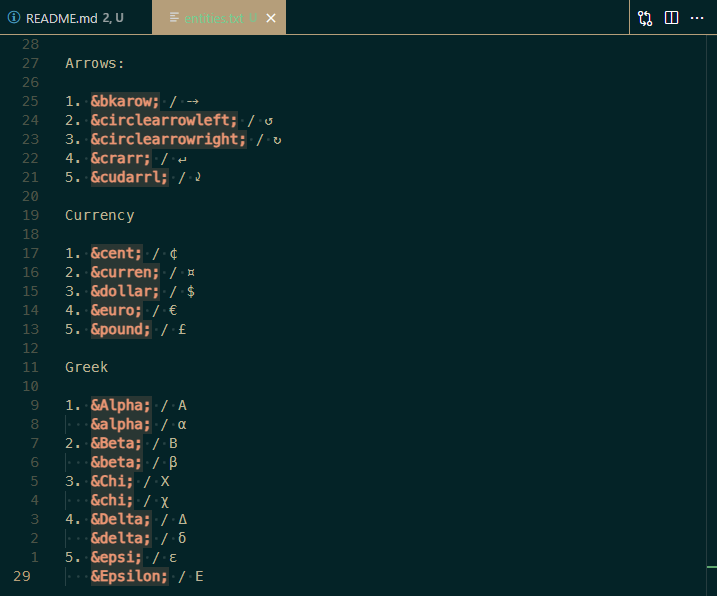
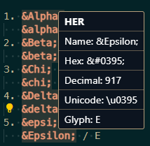
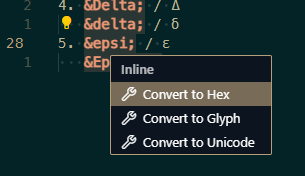
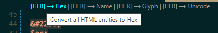
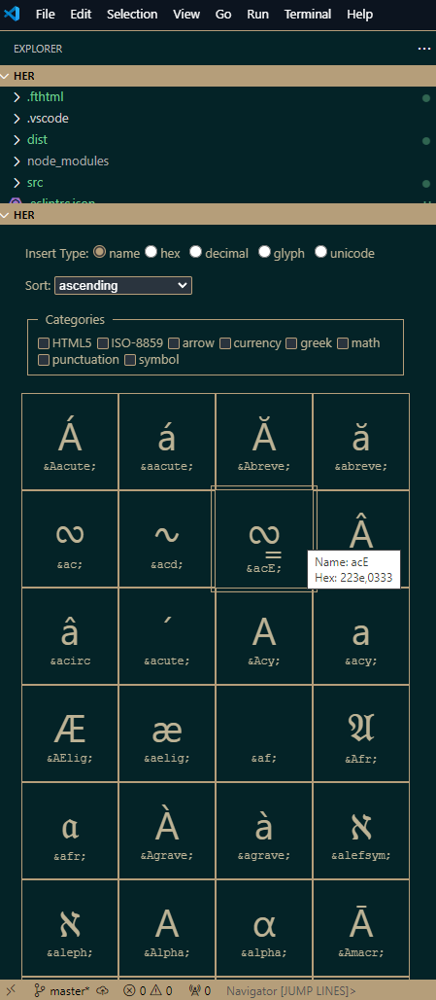

# HER

All about HTML entities

&aleph;&beth;&bkarow;&bigstar;&Bscr;&CapitalDifferentialD;&Cayleys;&check;&circlearrowleft;&circlearrowright;&circledR;&clubs;&commat;&complexes;

True story, AI made the icon for this. No I won't tell you which one

Check out [my other vscode extensions](https://marketplace.visualstudio.com/publishers/davidfreer) if you want

## Features

- Editor decorations for entities (configurable)

  

- Hover Documentation

  Displays information about an entity under the cursor

  

- Code Actions to convert an entity to unicode,hex,etc and vice versa

  

- Code Lens for Converting a Document/Range

  

- Custom Entity Explorer Panel

  Browse/Filter entities and click to insert into your document

  

## Install

https://marketplace.visualstudio.com/items?itemName=davidfreer.html-entity-reference

**Enjoy!**